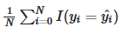

# Intro of DrivenData

At DrivenData, we want to bring cutting-edge practices in data science and crowdsourcing to some of the world's biggest social challenges and the organizations taking them on. We host online challenges, usually lasting 2-3 months, where a global community of data scientists competes to come up with the best statistical model for difficult predictive problems that make a difference. 
Our first step is to frame a good predictive question, one that can be solved by the data at hand and has measurable, real-world impact. We work with nonprofits to understand their needs and identify productive partnerships.

The next phase is to host an online, open-innovation competition where freelance developers and data scientists submit statistical models. Using our competition platform and evaluation engine, the models are ranked based on how well they predict data withheld from the competitors. 

Finally, we want to close the loop. We work with the organization to leverage the top model—as insight, a fresh statistical approach, or a tool for analyzing new data—enabling them to more effectively and sustainably carry out their mission.

# Competition - Pump it Up: Data Mining the Water Table 

## Can you predict which water pumps are faulty?

Using data from Taarifa and the Tanzanian Ministry of Water, can you predict which pumps are functional, which need some repairs, and which don't work at all? This is an intermediate-level practice competition. Predict one of these three classes based on a number of variables about what kind of pump is operating, when it was installed, and how it is managed. A smart understanding of which waterpoints will fail can improve maintenance operations and ensure that clean, potable water is available to communities across Tanzania.

Competition End Date: Jan. 28, 2017, 11:59 p.m.


## Evaluation Metric

Classification Rate = 

The metric used for this competition is the classification rate, which calculates the percentage of rows where the predicted class yHat
in the submission matches the actual class, y in the test set. The maximum is 1 and the minimum is 0. The goal is to maximize the classification rate.

## Data

This is where you'll find all of the documentation about this dataset and the problem we are trying to solve. 

### Features

Your goal is to predict the operating condition of a waterpoint for each record in the dataset. You are provided the following set of information about the waterpoints:

   * amount_tsh - Total static head (amount water available to waterpoint)
   * date_recorded - The date the row was entered
   * funder - Who funded the well
   * gps_height - Altitude of the well
   * installer - Organization that installed the well
   * longitude - GPS coordinate
   * latitude - GPS coordinate
   * wpt_name - Name of the waterpoint if there is one
   * num_private -
   * basin - Geographic water basin
   * subvillage - Geographic location
   * region - Geographic location
   * region_code - Geographic location (coded)
   * district_code - Geographic location (coded)
   * lga - Geographic location
   * ward - Geographic location
   * population - Population around the well
   * public_meeting - True/False
   * recorded_by - Group entering this row of data
   * scheme_management - Who operates the waterpoint
   * scheme_name - Who operates the waterpoint
   * permit - If the waterpoint is permitted
   * construction_year - Year the waterpoint was constructed
   * extraction_type - The kind of extraction the waterpoint uses
   * extraction_type_group - The kind of extraction the waterpoint uses
   * extraction_type_class - The kind of extraction the waterpoint uses
   * management - How the waterpoint is managed
   * management_group - How the waterpoint is managed
   * payment - What the water costs
   * payment_type - What the water costs
   * water_quality - The quality of the water
   * quality_group - The quality of the water
   * quantity - The quantity of water
   * quantity_group - The quantity of water
   * source - The source of the water
   * source_type - The source of the water
   * source_class - The source of the water
   * waterpoint_type - The kind of waterpoint
   * waterpoint_type_group - The kind of waterpoint

### Labels

The labels in this dataset are simple. There are three possible values:

  * functional - the waterpoint is operational and there are no repairs needed
  * functional needs repair - the waterpoint is operational, but needs repairs
  * non functional - the waterpoint is not operational

### Submission format

The format for the submission file is simply the row id and the predicted label (for an example, see SubmissionFormat.csv on the data download page.

For example, if you just predicted that all the waterpoints were functional you would have the following predictions:
```
id 	status_group
50785 	functional
51630 	functional
17168 	functional
45559 	functional
49871 	functional
```

Your .csv file that you submit would look like:

```
id,status_group
50785,functional
51630,functional
17168,functional
45559,functional
...
```
